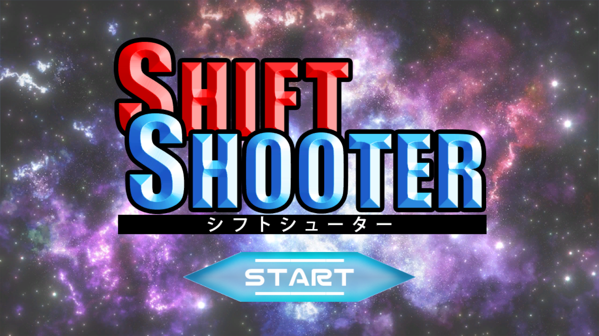
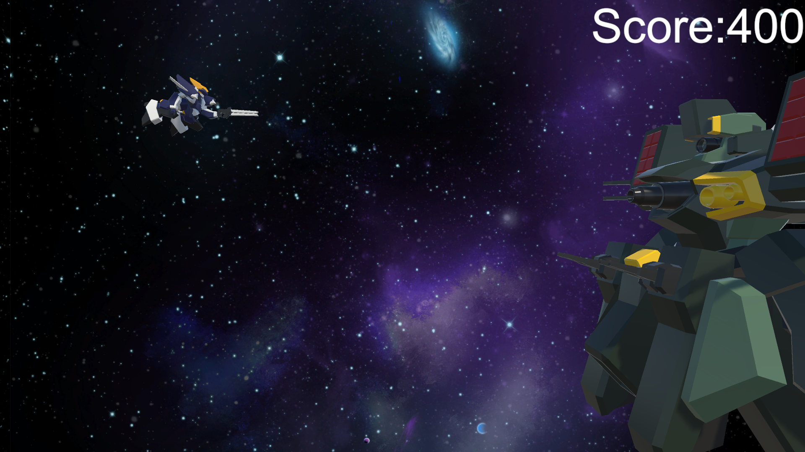
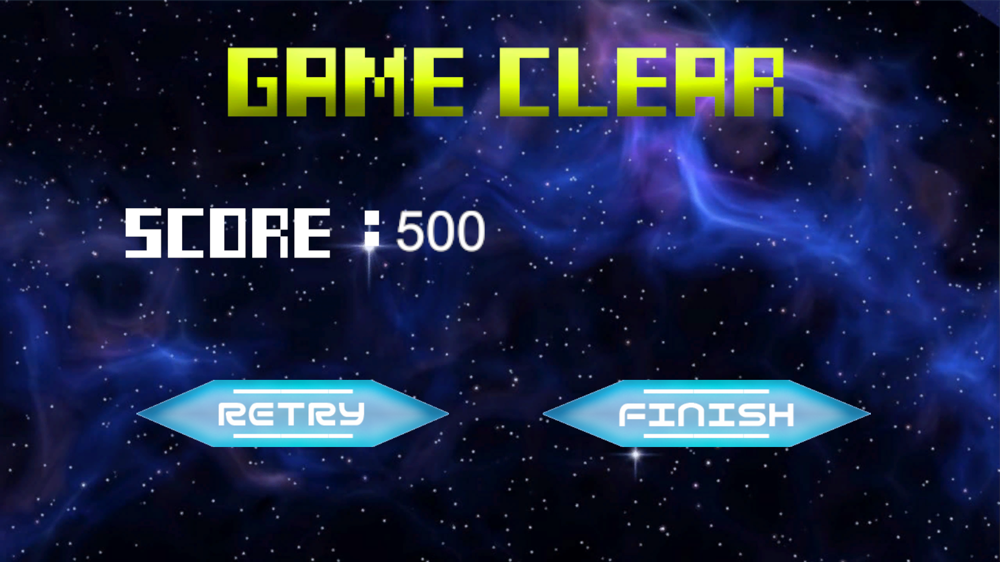

# SHIFTSHOOTER

## ファイル構成  
* [Unityデータ](https://github.com/c23008/SHIFTSHOOTER/tree/master/SHIFTSHOOTERbeta_Data)  
* [ビルドデータ](https://drive.google.com/drive/u/0/folders/1-t1VJWdACqt7LBpYwzlm5aj_wQWZXb9b)  

## ジャンル  
2Dシューティングアクション

## プラットフォーム  
* [Androidビルドデータ](https://drive.google.com/drive/u/0/folders/1Y21B8wULqMPryC4M7ckb3Ok8eJARKlL-)  
* [Windowsビルドデータ](https://drive.google.com/drive/u/0/folders/1t6oaL01yR57aoPzi14GXK-9HnIcslxKv)  

## 担当ブログラムファイル  
* [プレイヤーの動き](https://github.com/c23008/POPTHROW/blob/master/ProjectData/POPTHROW/Assets/ScriptsFolder/PlayerControll.cs)  
* [ゴールに近づくとスローになる演出](https://github.com/c23008/POPTHROW/blob/master/ProjectData/POPTHROW/Assets/ScriptsFolder/SlowSC.cs)  

## ゲームルール  
三種類の弾を状況に応じて使い分け、敵を倒すゲーム。
ライフを削られないように多くの敵を倒し、最後のボスを倒してハイスコアを目指す。

## Unityバージョン  
Unity 2021.3.30f1  

## 製作期間  
3か月

## メンバー（役割）  
* 呉屋匡哉（プログラマ）  
* 田村向（グラフィッカー）
* 新納功大（グラフィッカー）
* ヨシダ太尊（グラフィッカー）  

## ゲームスクリーンショット  
  
  
  

